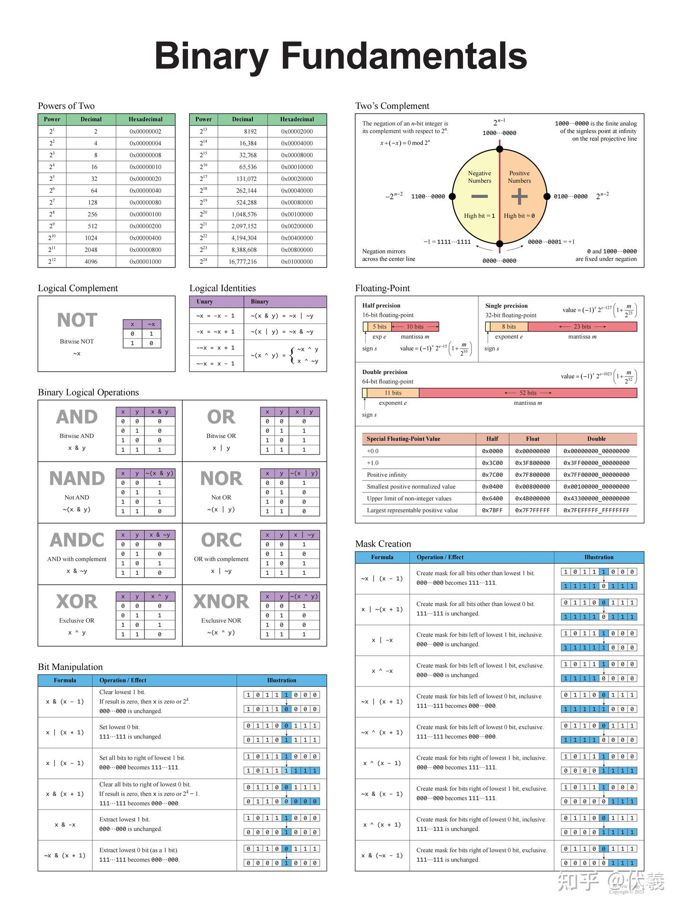

# 二进制探秘

我们在【C 语言入门】clings 练习中已经做过一道二进制相关的题目了：`count_bits`。这次我们继续往下挖一挖：计算机里的整数到底是怎样用二进制保存和运算的？为什么同样的位模式，用不同的类型解释会得到不同的结果？

先看下面这个简单的 C 程序：

```c
#include <stdio.h>

int main() {
	char a = 255;
	printf("a = %d\n", a);
}
```

在常见的 Linux GCC 环境下，运行结果是：

```txt
a = -1
```

为什么给 `char` 赋值 `255`，最后打印出来却是 `-1`？请带着这个问题开始下面的学习。不同编译器或平台的 `char` 默认有符号性可能不同，若你的结果与上面不同，也请记录运行环境和结果，并在学习笔记中解释原因。

再看一个例子：

```c
#include <stdio.h>

int main() {
	double a = 0.1;
	double b = 0.2;
	double c = 0.3;

	printf("0.1 + 0.2 == 0.3: %s\n", a + b == c ? "true" : "false");
	printf("0.1 + 0.2 = %.17f\n", a + b);
	printf("0.3 = %.17f\n", c);
}
```

在常见的 Linux GCC 环境下，运行结果类似于：

```txt
0.1 + 0.2 == 0.3: false
0.1 + 0.2 = 0.30000000000000004
0.3 = 0.29999999999999999
```

为什么十进制小数进行简单相加后，比较结果却不是相等？

## 学习要求

请自行学习 CSAPP 第 2 章 2.1～2.3 节，完成配套的 clings 练习仓库：

[Lingrui-Studio/lr-core-binary](https://github.com/Lingrui-Studio/lr-core-binary)

请 Star 并 Fork 这个仓库，在**你 Fork 的个人仓库中**完成练习并运行检查，完成练习后记得将修改上传至你的这个仓库中。

> 该仓库为原版 CSAPP 配套实验 Data Lab 的简化版，在开始之前，推荐阅读 [CSAPP 第二章与 Data Lab 心得体会 - 伏羲的文章](https://zhuanlan.zhihu.com/p/2038739293552760684)

重点学习整数部分，掌握到能够完成练习、解释题目现象即可。可以围绕下面这些方向学习：

- 二进制、十六进制与位模式之间的转换
- 无符号整数的表示、加法和溢出
- 补码表示，以及负数、取反和求相反数
- 有符号整数的表示范围、强制类型转换与溢出
- C 语言中不同整数类型的大小和取值范围
- 位运算：按位与、或、异或、取反、左移和右移
- 逻辑运算与位运算的区别
- 整数运算中有符号数和无符号数混合时的类型转换
- 截断、扩展以及大端序和小端序

学习时不要只背结论。请自己写一些短小的 C 程序，观察不同输入、不同类型的结果，并记录那些与直觉不一致的现象。

在完成练习的途中若遇到了难以解决的问题，可以在知乎搜索 `data lab` ，参考其他人的学习总结和题目 hint。

> 本题不作浮点数硬性要求。如果你对 CSAPP 第 2 章 2.4 节感兴趣，也可以额外学习 IEEE 754、舍入和浮点数运算，并把这部分内容写进笔记中。



## 提交说明

内容至少包括：

- 个人 Fork 的 clings 练习仓库链接
- 使用 clings 练习仓库时遇到的问题与解决方案（若有）
- 学习笔记：按顺序用**自己的话**梳理相关知识点，并有**良好的文档结构**
- 代码实验：学习笔记中应夹杂着自己学习过程中实际运行过的代码及运行结果
- 学习总结：总结你目前真正理解的内容和仍然困惑的问题
- 参考资料与 AI 对话链接：在文末列出实际阅读过的资料，以及与 AI 的对话链接，格式如下：

```markdown
## 参考资料

- [C 语言教程|菜鸟教程](https://www.runoob.com/cprogramming/c-tutorial.html)
- [为什么 C 语言字符串变量的长度总是要 +1](https://qianwen.my.cn/share/chat/8376c88ba3fc48809f26e51aad9ea3a7)
- [nixos 中的 home manager 推荐使用吗](https://qianwen.my.cn/share/chat/6ba2d99116674218be5bf294d72ad930)
```
