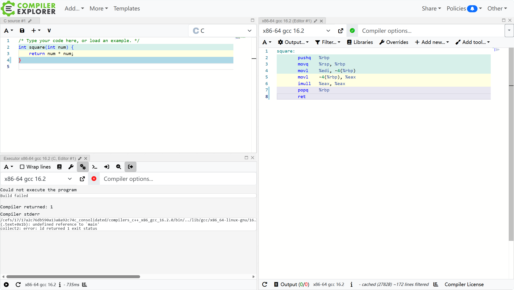

# 课题二：编译过程与汇编语言

> 预计耗时：4~7 天

## 引入

你写的 C 代码，机器其实一个字符都看不懂。一行 `sum += i`，到 CPU 真正执行，中间要经过预处理、编译、汇编、链接好几道工序，最后才变成机器指令。平时这些都由编译器再幕后处理，我们只管语法对不对；可要想搞清楚“程序到底在干什么”——变量放在哪、函数是怎么被调用的、`if` 为什么这么跳——终究要往下看一眼这层翻译的结果：**汇编**。

先看一段 C 程序：

```c
int sum_to(int n) {
    int sum = 0;
    for (int i = 1; i <= n; i++) {
        sum += i;
    }
    return sum;
}
```

它编译出来长什么样？[Compiler Explore](https://godbolt.org/) 是一个很常用的在线编译器，C/C++ 常用，但实际上它几乎支持所有语言，
你可以用它测试不同编译器的行为，或是研究程序生成的汇编代码/虚拟机指令，可以说是底层学习中不可或缺的工具。
比如你切换到 C 语言后，界面大致是这样的（也可能还需要调一下 Output 和 Filter）



你可以把上面那段 C 放进去，把优化等级从 `-O0` 调到 `-O2`，再对比右边的汇编——`-O0` 下它会照着你的写法在栈上一行行搬数据，`-O2` 下循环被拆开、变量存到了寄存器，看上去跟原来那段 C 已经没什么关系了。为什么会这样，就留给你自己在这一章里找答案了。

> 此外它还可以充当代码分享工具，右上角 `Share` 按钮会生成链接，其中包含了你的代码、编译配置、窗口布局等，实在是太良心了我哭死😭。

## 学习要求

- 学习 **CSAPP 第三章：程序的机器级表示**，统一要求 x86 Linux 环境，AT&T 格式
- 参考 [深入理解 C++ 编译过程：从源码到可执行程序的完整工具链](https://zhuanlan.zhihu.com/p/1927771884738551922) 简单了解 C/C++ 编译过程（文中以 C++ 为例，你可以在 AI 的帮助下用 C 语言走一遍编译过程）
- 参考 [CSAPP 第三章心得体会](https://zhuanlan.zhihu.com/p/2038903192025556058) 了解 bomb lab 的一些 tips
- 用模板仓库创建一个自己的仓库然后按 README 指引完成任务：https://github.com/Lingrui-Studio/lingrui-bomb-lab

## 提交要求

- 个人 lingrui-bomb-lab 的 GitHub 仓库链接
- 实验结果：运行 `sh tools/autograde.sh` 的结果
- 完成这道 lab 的经历：心路历程、阶段成果、踩过的坑……（不要知识点的堆砌）
- 参考资料
